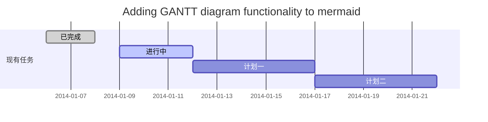
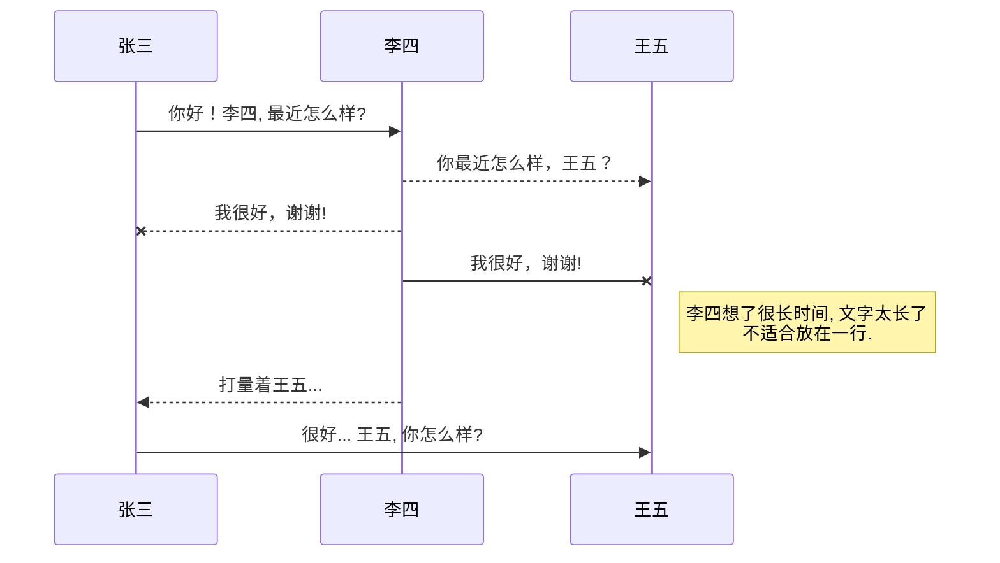
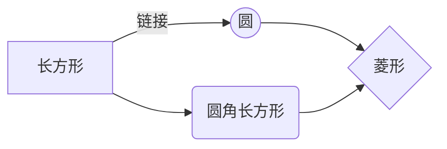

# Markdown Demo

​																																																	y=xisnx

---

## index

[1、初级用法 ](#1. 初级用法)

> [1.1 标题](#1.1 标题])
>
> [1.2 段落](#1.2 段落)
>
> [1.3 区块引用](#1.3 区块引用)
>
> [1.4 代码区块](#1.4 代码区块)
>
> [1.5 强调](#1.5 强调)
>
> [1.6 列表](#1.6 列表)
>
> [1.7 分割线](#1.7 分割线)
>
> [1.8 链接](#1.8 链接)
>
> [1.9 图片](#1.9 图片)
>
> [1.10 反斜杠](#1.10 反斜杠)
>
> [1.11 符号'`'](#1.10 反斜杠)
>
> [1.12 特殊样式的字符(HTML标签)](#1.12 特殊样式的字符(HTML标签))
>
> [1.13 表格](#1.13 表格)

[2、高级用法](#2. 高级用法)

> [2.1 KaTeX数学公式](#2.1 KaTeX数学公式)
>
> [2.2 甘特图](#2.2 甘特图)
>
> [2.3 UML 图表](#2.3 UML 图表)
>
> [2.4 Mermaid流程图](#2.4 Mermaid流程图)
>
> [2.5 FLowchart流程图](#2.5 FLowchart流程图)

[3、LaTeX公式编辑器语法](#3、LaTeX公式编辑器语法)

> [3.1 上标](#3.1 上标)
>
> [3.2 下标](#3.2 下标)
>
> [3.3 排列数](#3.3 排列数)
>
> [3.4 log数](#3.4 log数)
>
> [3.5 三角函数](#3.5 三角函数)
>
> [3.6 希腊字母](#3.6 希腊字母)
>
> [3.7 乘法](#3.7 乘法)
>
> [3.8 除法](#3.8 除法)
>
> [3.9 开根号](#3.9 开根号)
>
> [3.10 矩阵](#3.10 矩阵)
>
> [3.11 多个公式](#3.11 多个公式)
>
> [3.12 几何学](#3.12 几何学)
>
> [3.13 集合](#3.13 集合)
>
> [3.14 一些其他常用符号](#3.14 一些其他常用符号)


## [1. 初级用法](#index)

#### [1.1 标题](#index)

两种形式：  
1）使用`=`和`-`标记一级和二级标题。

> 一级标题   
> `=========`   
> 二级标题    
> `---------`

效果：

> 一级标题   
> =========   
>
> 二级标题
> ---------  

2）使用`#`，可表示1-6级标题。

> \# 一级标题   
> \## 二级标题   
> \### 三级标题   
> \#### 四级标题   
> \##### 五级标题   
> \###### 六级标题    

效果：

> # 一级标题   
>
> ## 二级标题   
>
> ### 三级标题   
>
> #### 四级标题   
>
> ##### 五级标题   
>
> ###### 六级标题

#### [1.2 段落](#index)

段落的前后要有空行，所谓的空行是指没有文字内容。若想在段内强制换行的方式是使用**两个以上**空格加上回车（引用中换行省略回车）。

#### [1.3 区块引用](#index)

在段落的每行或者只在第一行使用符号`>`,还可使用多个嵌套引用，如：

> \> 区块引用  
> \>> 嵌套引用  

效果：

> 区块引用  
>
> > 嵌套引用

#### [1.4 代码区块](#index)

代码区块的建立是在每行加上4个空格或者一个制表符（如同写代码一样）。如    
普通段落：

void main()    
{    
    printf("Hello, Markdown.");    
}    

代码区块：

```c
void main()
{
    printf("Hello, Markdown.");
}
```

**注意**:需要和普通段落之间存在空行。

#### [1.5 强调](#index)

在强调内容两侧分别加上`*`或者`_`，如：

> \*斜体\*，\_斜体\_    
> \*\*粗体\*\*，\_\_粗体\_\_

效果：

> *斜体*，_斜体_    
> **粗体**，__粗体__

#### [1.6 列表](#index)

使用`·`、`+`、或`-`标记无序列表，如：

> \-（+\*） 第一项
> \-（+\*） 第二项
> \- （+\*）第三项

**注意**：标记后面最少有一个_空格_或_制表符_。若不在引用区块中，必须和前方段落之间存在空行。

效果：

> + 第一项
> + 第二项
> + 第三项

有序列表的标记方式是将上述的符号换成数字,并辅以`.`，如：

> 1 . 第一项   
> 2 . 第二项    
> 3 . 第三项    

效果：

> 1. 第一项
> 2. 第二项
> 3. 第三项

#### [1.7 分割线](#index)

分割线最常使用就是三个或以上`*`，还可以使用`-`和`_`。

#### [1.8 链接](#index)

链接可以由两种形式生成：**行内式**和**参考式**。    
**行内式**：

> \[Mr-Gump的Github仓库\]\(https://github.com/Mr-Gump/)。

效果：

> [Mr-Gump的Markdown库](https://github.com/Mr-Gump/)。

**参考式**：

> [Mr-Gump的Github仓库1\]\[1\]    
> \[Mr-Gump的Github仓库2\]\[2\]    
> \[1\]:https://github.com/Mr-Gump/    
> \[2\]:https://github.com/Mr-Gump/

效果：

> [Mr-Gump的Github仓库1][1]    
> [Mr-Gump的Github仓库2][2]

[1]: https://github.com/Mr-Gump/
[2]: https://github.com/Mr-Gump/

**注意**：上述的`[1]:https://github.com/Mr-Gump/不出现在区块中。

#### [1.9 图片](#index)

添加图片的形式和链接相似，只需在链接的基础上前方加一个`！`。

>  \!\[Alt](https://imgconvert.csdnimg.cn/aHR0cHM6Ly9hdmF0YXIuY3Nkbi5uZXQvNy83L0IvMV9yYWxmX2h4MTYzY29tLmpwZw)

效果


#### [1.10 反斜杠`\`](#index)

相当于**反转义**作用。使符号成为普通符号。

#### [1.11 符号'`'](#index)

起到标记作用。如：

>\`ctrl+a\`

效果：

>`ctrl+a`    

#### [1.12 特殊样式的字符(HTML标签)](#index)

1)按键样式

> \<kbd>ctrl\</kbd>

效果

> <kbd>ctrl</kbd>

2)删除线

> ```
> ~~删除线~~
> ```

效果

> ​		~~删除线~~

3)下划线

> \<u>下划线\</u>

效果

> <u>下划线</u>

4)代办

> \-  [ ] 未勾选
>
> \-  [x]已勾选

效果

> - [ ] 计划任务
> - [x] 完成任务

#### [1.13 表格](#index)

使用`:---------:`居中
使用`:----------`居左
使用`----------:`居右

\| 第一列       | 第二列         | 第三列        |
\|:-----------:| -------------:|:-------------|
\| 第一列文本居中 | 第二列文本居右  | 第三列文本居左 |

效果

|     第一列     |         第二列 | 第三列         |
| :------------: | -------------: | :------------- |
| 第一列文本居中 | 第二列文本居右 | 第三列文本居左 |


## [2. 高级用法](#index)

#### [2.1 KaTeX数学公式](#index)

您可以使用渲染LaTeX数学表达式 [KaTeX](https://khan.github.io/KaTeX/):

Gamma公式展示 $\Gamma(n) = (n-1)!\quad\forall
n\in\mathbb N$ 是通过欧拉积分

> \$$
> 					x \Gamma(z) = \int_0^\infty t^{z-1}e^{-t}dt\,.
>
> \$$				

效果
$$
\Gamma(z) = \int_0^\infty t^{z-1}e^{-t}dt\,.
$$

> 你可以找到更多关于的信息 **LaTeX** 数学表达式[here](http://meta.math.stackexchange.com/questions/5020/mathjax-basic-tutorial-and-quick-reference ).

#### [2.2 甘特图](#index)

> gantt
>         dateFormat  YYYY-MM-DD
>         title Adding GANTT diagram functionality to mermaid
>         section 现有任务
>         已完成               :done,    des1, 2014-01-06,2014-01-08
>         进行中               :active,  des2, 2014-01-09, 3d
>         计划一               :         des3, after des2, 5d
>         计划二               :         des4, after des3, 5d

效果


- 关于 **甘特图** 语法，参考 [这儿](https://mermaidjs.github.io/ ),

#### [2.3 UML 图表](#index)

可以使用UML图表进行渲染。 [Mermaid](https://mermaidjs.github.io/). 例如下面产生的一个序列图：

> sequenceDiagram
> 张三 ->> 李四: 你好！李四, 最近怎么样?
> 李四-->>王五: 你最近怎么样，王五？
> 李四--x 张三: 我很好，谢谢!
> 李四-x 王五: 我很好，谢谢!
> Note right of 王五: 李四想了很长时间, 文字太长了<br/>不适合放在一行.
>
> 李四-->>张三: 打量着王五...
> 张三->>王五: 很好... 王五, 你怎么样?

效果



#### [2.4 Mermaid流程图](#index)

> graph LR
> A[长方形] -- 链接 --> B((圆))
> A --> C(圆角长方形)
> B --> D{菱形}
> C --> D

效果



- 关于 **Mermaid** 语法，参考 [这儿](https://mermaidjs.github.io/ ),

#### [2.5 FLowchart流程图](#index)

> flowchat
> st=>start: 开始
> e=>end: 结束
> op=>operation: 我的操作
> cond=>condition: 确认？
>
> st->op->cond
> cond(yes)->e
> cond(no)->op

效果

```flow
flowchat
st=>start: 开始
e=>end: 结束
op=>operation: 我的操作
cond=>condition: 确认？

st->op->cond
cond(yes)->e
cond(no)->op
```

- 关于 **Flowchart流程图** 语法，参考 [这儿](http://adrai.github.io/flowchart.js/).


## [3、LaTeX公式编辑器语法](#index)

#### [3.1 上标](#index)

> \x^{20}

$$
x^{20}
$$

#### [3.2 下标](#index)

> \text{H}_2\text{O}

$$
\text{H}_2\text{O}
$$

#### [3.3 排列数](#index)

> \text{C}^2_7

$$
\text{C}^2_7
$$

#### [3.4 log数](#index)

> \log_3 5 

$$
\log_3 5
$$

#### [3.5 三角函数](#index)

> \sin({x}^2)

$$
\sin({x}^2)
$$


#### [3.6 希腊字母](#index)

> \delta\Delta

$$
\delta\Delta
$$


#### [3.7 乘法](#index)

> 3\times4=12

$$
3\times4=12
$$


#### [3.8 除法](#index)

> \dfrac {20}{3}

$$
\dfrac {20}{3}
$$


#### [3.9 开根号](#index)

> h=\sqrt{\dfrac{2h}{g}}

$$
h=\sqrt{\dfrac{2h}{g}}
$$

#### [3.10 矩阵](#index)

> ```text
> %斜杆必须在数字的后边。一行结束两个斜杆
> %方括号矩阵：bmatrix 圆括号矩阵：pmatrix 行列式：vmatrix 矩阵的范数：Vmatrix
> \begin{bmatrix}
> 1&2& 3\\
> 4& 5&6\\
> 7& 8&9\\
> \end{bmatrix}
> ```

$$
%斜杆必须在数字的后边。一行结束两个斜杆
%方括号矩阵：bmatrix 圆括号矩阵：pmatrix 行列式：vmatrix 矩阵的范数：Vmatrix
\begin{bmatrix}
1&2& 3\\
4& 5&6\\
7& 8&9\\
\end{bmatrix}
$$


#### [3.11 多个公式](#index)

> ```text
> \begin{matrix}
> \sin2x=2\sin{x}\cos{x}\\
> \sin(x)^2+cos(x)^2=1\\
> \end{matrix}
> ```

$$
\begin{matrix}
\sin2x=2\sin{x}\cos{x}\\
\sin(x)^2+cos(x)^2=1\\
\end{matrix}
$$


#### [3.12 几何学](#index)

> ```text
> \overline{U}
> \angle ABC
> \triangle ABC
> \text{A}\bot\text{B}
> ```

$$
\overline{U}
\angle ABC
\triangle ABC
\text{A}\bot\text{B}
$$


#### [3.13 集合](#index)

> ```text
> A\cup B
> M\cap N
> \overline{U}
> ```

$$
A\cup B
M\cap N
\overline{U}
$$


#### [3.14 一些其他常用符号](#index)

> \partial 偏导数 ![[公式]](https://www.zhihu.com/equation?tex=%5Cdfrac%7B%5Cpartial+y%7D%7B%5Cpartial+x%7D)
>
> \forall 任意 ![[公式]](https://www.zhihu.com/equation?tex=%5Cforall)
>
> \exists 存在 ![[公式]](https://www.zhihu.com/equation?tex=%5Cexists)
>
> \infty 无穷大 ![[公式]](https://www.zhihu.com/equation?tex=%5Cinfty)
>
> \sum 求和 ![[公式]](https://www.zhihu.com/equation?tex=%5Csum)
>
> \sim 相似 ![[公式]](https://www.zhihu.com/equation?tex=%5Csim)
>
> \overset{x=t}{=} ![[公式]](https://www.zhihu.com/equation?tex=%5Coverset%7Bx%3Dt%7D%7B%3D%7D)
>
> \tag(1) 给公式标号
>
> \\公式居中
>
> \lim 极限
>
> \to 箭头 ![[公式]](https://www.zhihu.com/equation?tex=%5Cto)
>
> \in 属于 \notin 不属于 ![[公式]](https://www.zhihu.com/equation?tex=%5Cnotin)


